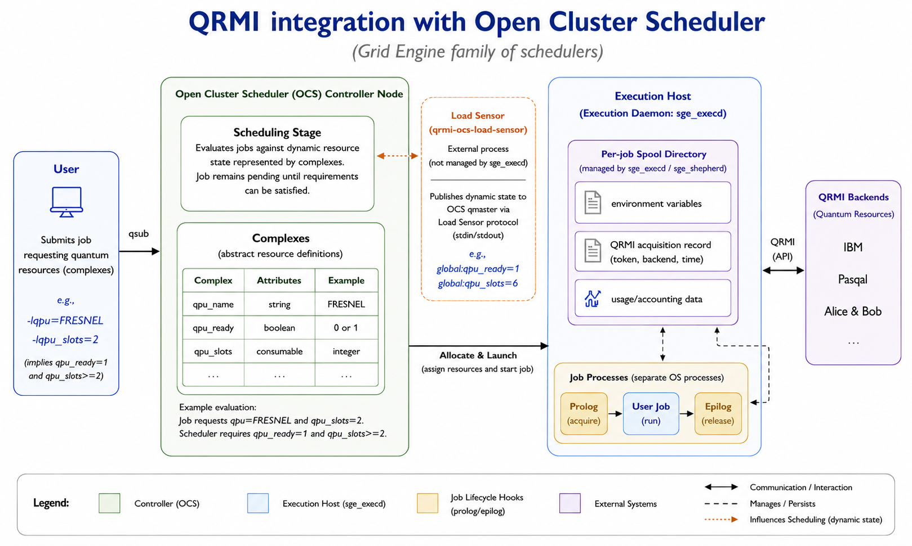

# QRMI Adapter for Grid Engine

**Schedule vendor-agnostic quantum resources through familiar `qsub` jobs.**

[](https://arxiv.org/abs/2607.19591)
[](https://go.dev/)
[](LICENSE)

[Paper](https://arxiv.org/abs/2607.19591) ·
[Admin runbook](docs/quickinstall-testing.md) ·
[Load Sensor guide](load_sensor.md) ·
[QRMI](https://github.com/qiskit-community/qrmi)

This repository connects the
[Quantum Resource Management Interface (QRMI)](https://github.com/qiskit-community/qrmi)
to the Grid Engine family of schedulers, including
[Open Cluster Scheduler (OCS)](https://github.com/hpc-gridware/clusterscheduler)
and Gridware Cluster Scheduler (GCS). QPUs and emulators become schedulable
resources alongside CPUs and GPUs, while QRMI keeps jobs independent of
provider-specific APIs.

This is the completed Grid Engine integration examined in the 2026 paper
[*Examining QRMI as a Unified Interface for Quantum-HPC Integration*](https://arxiv.org/abs/2607.19591).
It covers the scheduler, lifecycle, configuration, dynamic state, and
accounting behavior described there.

## Implementation Status

**The Grid Engine/OCS scope claimed in the paper is implemented in this
repository.**

| Paper capability | Implementation |
| --- | --- |
| Scheduler-native quantum resource selection and constraints | `qpu`, `qpu_slots`, and `qpu_ready` complexes configured by `gridware-adapter` |
| Dynamic readiness and capacity | OCS Load Sensor with static and Pasqal Warden providers |
| Lifecycle management | QRMI acquisition in the queue prolog and release in the epilog |
| Provider-independent configuration | Logical resource lookup through `qrmi_config.json` |
| Runtime state and accounting | Per-job spool metadata, environment variables, and `qrmi_*` fields exposed through `qacct` |

The Pasqal Cloud `EMU_FREE` path is available with released QRMI versions. The
Pasqal Local slot-capacity path is also implemented here, but currently depends
on two pending upstream changes before it is available from released
dependencies:

- [QRMI #164: Add QPU slots to Pasqal local QRMI](https://github.com/qiskit-community/qrmi/pull/164)
- [Warden #73: Add Warden-side features for QPU slots](https://github.com/pasqal-io/warden/pull/73)

Until those changes are merged and released, use their matching
`aw/qpu-slots` branches for Pasqal Local validation. Their pending status is an
upstream release dependency, not unfinished Grid Engine adapter work.

## Architecture



*The implemented OCS architecture. A job is admitted through scheduler-native
complexes, acquires its quantum resource in the queue prolog, and releases it
in the epilog. The Load Sensor feeds current readiness and capacity into
scheduling decisions when dynamic state is enabled.*

The integration follows three main ideas from the paper:

- **Scheduler-native requests:** users select a quantum resource with ordinary
  Grid Engine syntax instead of a provider-specific submission tool.
- **Thin lifecycle hooks:** the prolog acquires through QRMI and the epilog
  releases the resource and records usage.
- **Provider separation:** scheduler configuration names logical resources;
  `qrmi_config.json` owns provider resource types and runtime settings.

### Resource model

| Complex | Type and relation | Consumable | Purpose |
| --- | --- | --- | --- |
| `qpu` | `STRING ==` | No | Select one logical QRMI resource |
| `qpu_slots` | `INT <=` | Per job | Request capacity from that resource |
| `qpu_ready` | `INT <=` | No | Require dynamic availability reported by a Load Sensor |

`qpu` is deliberately a selector, not a consumable. Grid Engine requires
consumables to be numeric and use `<=`, so capacity belongs in a separate
complex such as `qpu_slots`. See [the resource-model note](consumable-issue.md)
for the scheduler constraints behind this design.

Submit against a configured resource:

```bash
# Selection only
qsub -l qpu=EMU_FREE job.sh

# Selection plus dynamic readiness and capacity
qsub -l qpu=PASQAL_FRESNEL,qpu_ready=1,qpu_slots=2 job.sh
```

The second request is a conjunction: OCS dispatches it only when the host
advertises `PASQAL_FRESNEL`, the backend is ready, and at least two QPU slots
are available. Resource names are administrator-defined entries in
`qrmi_config.json`; use the name deployed at your site.

### Job lifecycle

1. The user submits a normal `qsub` request for `qpu` and optional constraints.
2. OCS evaluates the request against host complexes and Load Sensor values.
3. The queue prolog resolves the granted name, checks accessibility, acquires
   the QRMI resource, and publishes runtime metadata to the job environment.
4. The user job talks to the selected backend through QRMI.
5. The queue epilog releases the resource and writes `qrmi_*` usage fields for
   `qacct` and accounting integrations.

## Start Here

| Audience | First step |
| --- | --- |
| Users | Submit the [smoke job](#end-user-quick-start-ocs), then follow the [Pasqal Cloud test](docs/quickinstall-testing.md#3-pasqal-cloud-pulser-test-on-ocs) |
| Administrators | Follow the [quickinstall runbook](docs/quickinstall-testing.md) or use [`setup-qrmi-support`](#setup-qrmi-support-default) |
| Developers | Build and test below, then start with the adapter and Go hook commands under `src/cmd/` |

## Repository Map

| Path | Role |
| --- | --- |
| `src/cmd/gridware-adapter` | Configures complexes, host mappings, queue hooks, Load Sensors, and reporting |
| `src/cmd/qrmi-ocs-load-sensor` | Publishes dynamic QPU readiness and capacity |
| `src/cmd/qrmi-ocs-prolog-go` / `qrmi-ocs-epilog-go` | Preferred Go lifecycle hooks |
| `src/cmd/qrmi-ocs-prolog` / `qrmi-ocs-epilog` | Legacy C lifecycle hooks |
| `src/internal/availability` | Static and Pasqal Warden availability providers |
| `src/internal/qrmi` | cgo wrapper around `libqrmi.so` |
| `src/internal/qrmiocs` | Scheduler environment, spool, metadata, and logging support |
| `docs/quickinstall-testing.md` | OCS installation and Pasqal Cloud validation runbook |
| `docs/figs` | Documentation figures, including the OCS architecture above |
| `load_sensor.md` | Pasqal Local, Warden, and Load Sensor operations |
| `demo/qrmi` | Runnable smoke and Load Sensor checks |

## Build

The repository ships a Makefile that wraps the Docker-based build flows.

### Adapter (no cgo)

```bash
make build-adapter
# binary at bin/adapter/adapter

make build-load-sensor
# binary at bin/adapter/qrmi-ocs-load-sensor
```

### Go OCS hooks (cgo against `libqrmi.so`)

The Go ports use cgo to link against `libqrmi.so`. The Docker build in
`scripts/Dockerfile.hooks` clones QRMI from upstream, builds the shared
library, then cgo-builds the Go binaries against it. Output is written
under `bin/go-hooks/`:

```bash
make build-go-hooks                    # builds against QRMI v0.20.0 by default
make build-go-hooks QRMI_REF=main      # builds against QRMI main
```

The standard Docker target builds the cloud-capable QRMI library. Pasqal Local
also requires QRMI's `munge` feature and `libmunge`; follow the
[Pasqal Local build notes](load_sensor.md#build-artifacts) and use the
`aw/qpu-slots` QRMI branch until PR #164 is released.

Outputs in `bin/go-hooks/`:

- `qrmi-ocs-prolog`
- `qrmi-ocs-epilog`
- `libqrmi.so`

The hook binaries embed `rpath=$ORIGIN`, so as long as `libqrmi.so` sits
beside them on the execution host they will resolve the library without
any `LD_LIBRARY_PATH` mangling.

### Legacy C hooks

The Go prolog and epilog are the current implementations. The legacy C hooks
under `src/cmd/qrmi-ocs-prolog/` and `src/cmd/qrmi-ocs-epilog/` remain for
compatibility and have the same external contract. See
[Build queue hooks](#build-queue-hooks) for their build instructions.

### Tests

```bash
make test    # runs Go tests and the legacy C harnesses
make vet
```

Two legacy C-harness tests in `src/cmd/gridware-adapter`
(`TestPrologApplyBackendEnvUsesConfiguredValue` and
`TestEpilogStrictMetadataBehavior`) compile against a sibling `qrmi/` checkout
at `${GOPATH}/src/github.com/hpc-gridware/qrmi`. That checkout must exist and
its headers must match the test harness; a missing checkout or a newer C API
can fail those tests before the Go-native suite runs.

## End-User Quick Start (OCS)

Admin prerequisite: run `setup-qrmi-support` once on the target OCS queue.

Submit a quick smoke job:

```bash
qsub -b y -terse -l qpu=EMU_FREE /bin/echo OCS_QRMI_OK
```

For a real Pasqal Cloud Pulser task, follow
`docs/quickinstall-testing.md` section `3`.

## Pasqal Cloud Access (`EMU_FREE`)

Pasqal documents free emulator access in the Explorer Offer, including `EMU_FREE`:
- https://docs.pasqal.com/cloud/set-up/

Start from the portal:
- https://portal.pasqal.cloud

Then get your project ID from the same "Join Pasqal Cloud" guide ("Find your project ID"),
and configure credentials on submit/exec hosts:

```bash
mkdir -p ~/.pasqal
cat > ~/.pasqal/config <<'EOF'
username=<your_email>
password=<your_password_or_token_flow>
project_id=<your_project_id>
auth_endpoint=https://authenticate.pasqal.cloud/oauth/token
EOF
chmod 600 ~/.pasqal/config
```

## Admin Guide

Admin setup and verification details are in `docs/quickinstall-testing.md`.
The key operational model is:

- Scheduler resource: `qpu` as `STRING` with relop `==`
- Consumable policy: `qpu` is configured as `NO` (backend selector only)
- Host assignment: one backend name per host (for example `qpu=EMU_FREE`)
- Optional capacity resource: `qpu_slots` as `INT`, `<=`, `Consumable=JOB`
- Optional readiness resource: `qpu_ready` as `INT`, `<=`, `consumable=NO`
- Job request without Load Sensor: `-l qpu=<backend>` (for example `-l qpu=EMU_FREE`)
- Job request with Load Sensor: `-l qpu=<backend>,qpu_slots=1,qpu_ready=1`

### Admin Quick Checklist

1. Build and copy adapter binary to scheduler master (`/tmp/adapter` in quickinstall flow).
2. Build and copy queue hooks + `libqrmi.so` to scheduler master.
3. Run `setup-qrmi-support` to apply resource, host mapping, queue hooks, and reporting params in one command.
4. Verify `qsub -l qpu=<backend>` succeeds.

## Adapter Commands (Admin/Advanced Users)

### `setup-qrmi-support` (Default)

Apply all required OCS-side QRMI setup in one command:

- ensure `qpu` complex entry (`STRING`, `==`, `requestable=YES`, `consumable=NO`)
- set host `complex_values` to one backend name per host
- set queue `prolog` and `epilog`
- ensure global `reporting_params` contains `usage_patterns=qrmi:qrmi_*`

The adapter installs the QRMI hooks as `root@` procedures and passes Grid
Engine's `$job_owner` value to the prolog. This lets the hooks update the
root-owned job spool and call administrator-only QRMI acquisition endpoints
while the acquired session remains owned by the submitting user. Hook binaries
and their parent directories must therefore be writable only by administrators.
The adapter stores the QRMI config path, absolute `qstat` path, and resource names
in the administrator-owned queue prolog command. The
root hook does not accept those values or resource grants from the submitted
job environment.

```bash
./adapter setup-qrmi-support \
  --hosts ocs-master,ocs-worker1,ocs-worker2 \
  --host-value EMU_FREE \
  --queue all.q \
  --prolog /shared/gridware-adapter/bin/qrmi-ocs-prolog \
  --epilog /shared/gridware-adapter/bin/qrmi-ocs-epilog
```

Optional Load Sensor setup keeps capacity and readiness separate:

```bash
./adapter setup-qrmi-support \
  --hosts ocs-master,ocs-worker1,ocs-worker2 \
  --host-value PASQAL_LOCAL \
  --queue all.q \
  --prolog /shared/gridware-adapter/bin/qrmi-ocs-prolog \
  --epilog /shared/gridware-adapter/bin/qrmi-ocs-epilog \
  --enable-qpu-slots \
  --qpu-slots-capacity 0 \
  --enable-load-sensor \
  --load-sensor-host ocs-master \
  --load-sensor-path /shared/gridware-adapter/bin/qrmi-ocs-load-sensor
```

Use `--qpu-slots-capacity 0` for Warden-owned Pasqal Local slots. Use a
positive value only when OCS should own static host-local slot capacity.
For one statically configured backend shared by several hosts, add
`--qpu-slots-scope global`.

OCS stores `load_sensor` as an executable path. Put the configuration at
`/etc/qrmi-ocs-load-sensor.yaml`, or set `QRMI_OCS_LOAD_SENSOR_CONFIG` when
running the sensor manually. Load Sensor configuration:

```yaml
load_sensor:
  enabled: true
  scope: global
  resource_name: qpu_ready
  slots_resource_name: qpu_slots
  provider: warden
  timeout_seconds: 3

warden:
  base_url: http://127.0.0.1:8006
  endpoint: /accessible
  slots_endpoint: /qpu-slots
  tls_verify: true

static:
  ready: true
  state_file: ""
```

The `static` provider either returns `static.ready` or reads `0`/`1` from
`static.state_file`. It provides deterministic state for scheduler validation
without a live provider and does not represent Pasqal Cloud queue availability.
The `warden` provider polls `GET /accessible` for readiness and, when a slots
resource is configured, `GET /qpu-slots` for `qpu_slots_available`. It fails
closed on timeouts, HTTP errors, or malformed responses.

The Load Sensor is an early scheduler filter only. The OCS prolog still calls
QRMI `IsAccessible` and `Acquire`, so a job can still be rejected at dispatch
time if another scheduler or user consumed the external QPU after OCS scheduled
the job.

For the Pasqal Local setup, including Warden, MUNGE, QRMI config, and the
readiness Load Sensor, see `load_sensor.md`.

### `ensure-resource` (Advanced/Manual)

Ensure the scheduler complex entry exists and set host `complex_values`.

Use `STRING` with one backend name per host:

```bash
./adapter ensure-resource \
  --qconf qconf \
  --hosts ocs-master,ocs-worker1,ocs-worker2 \
  --host-value EMU_FREE
```

If hosts target different backends, run per host (or host group):

```bash
./adapter ensure-resource \
  --hosts ocs-worker1 \
  --host-value EMU_FREE

./adapter ensure-resource \
  --hosts ocs-worker2 \
  --host-value EMU_FREE
```

### `configure-queue-hooks` (Advanced/Manual)

Configure `prolog`, `epilog`, and `reporting_params`.

```bash
./adapter configure-queue-hooks \
  --queue all.q \
  --prolog /shared/gridware-adapter/bin/qrmi-ocs-prolog \
  --epilog /shared/gridware-adapter/bin/qrmi-ocs-epilog
```

### Build queue hooks

Compile against the QRMI C API (`qrmi/qrmi.h`) and shared library:

```bash
mkdir -p /shared/gridware-adapter/bin

gcc -Wall -Wextra -O2 \
  -I/shared/qrmi \
  -L/shared/qrmi/libqrmi-0.20.0 \
  -Wl,-rpath,'$ORIGIN' \
  -o /shared/gridware-adapter/bin/qrmi-ocs-prolog \
  /shared/gridware-adapter/src/cmd/qrmi-ocs-prolog/main.c \
  -lqrmi

gcc -Wall -Wextra -O2 \
  -I/shared/qrmi \
  -L/shared/qrmi/libqrmi-0.20.0 \
  -Wl,-rpath,'$ORIGIN' \
  -o /shared/gridware-adapter/bin/qrmi-ocs-epilog \
  /shared/gridware-adapter/src/cmd/qrmi-ocs-epilog/main.c \
  -lqrmi

cp /shared/qrmi/libqrmi-0.20.0/libqrmi.so /shared/gridware-adapter/bin/
```

Hook behavior:

- Prolog reads granted scheduler resource, resolves one backend name, acquires QRMI token, and writes runtime variables into the job environment.
- Prolog reads the dispatched job's resource list from the administrator-configured `qstat -j` command.
- Acquisition metadata is stored only in the scheduler-owned job spool.
- Epilog reads acquisition metadata and releases tokens.
- Epilog expects exactly one metadata record; multiple records are treated as an error.
- Prolog publishes runtime `qrmi_*` values in the job environment.
- Epilog appends numeric `qrmi_*` values into `${SGE_JOB_SPOOL_DIR}/usage` so they are captured by `usage_patterns=qrmi:qrmi_*` and appear in `qacct`/accounting JSON.
- Typical runtime `qrmi_*` variables from prolog:
  - `qrmi_resources`: backend/resource names acquired by prolog.
  - `qrmi_resource_types`: QRMI resource types for acquired backends.
  - `qrmi_prolog_status`: prolog outcome (`success` or `error`).
- Typical runtime error variable from prolog:
  - `QRMI_PLUGIN_ERROR`: prolog error text when a failure occurs.
- Typical accounting `qrmi_*` fields in `qacct` / accounting JSON:
  - `qrmi_acquired_count`: number of acquired resources (published from epilog usage data).
  - `qrmi_release_total`: number of non-empty metadata records seen before release handling (`0` or `1` in strict single-record mode).
  - `qrmi_release_success`: number of successful releases in epilog.
  - `qrmi_release_failed`: number of failed releases in epilog.
  - `qrmi_release_elapsed_seconds`: epilog release-loop elapsed time.
  - `qrmi_epilog_status_code`: epilog outcome as numeric code (`1` success, `0` error).
- If `RUST_LOG` is unset, prolog derives it from `QRMI_OCS_LOG_LEVEL` (or `SGE_DEBUG_LEVEL`) using:
  - `2 -> error`, `3 -> info`, `4 -> debug`, `>=5 -> trace`

### Behavior vs SPANK Plugin

This Gridware/OCS adapter mirrors core SPANK behavior in these areas:

- Loads backend settings from `qrmi_config.json` and exports backend-prefixed `QRMI_*` variables.
- Sets `RUST_LOG` from scheduler debug level mapping when `RUST_LOG` is not already set.
- Exports `QRMI_JOB_QPU_RESOURCES` and `QRMI_JOB_QPU_TYPES` for runtime compatibility.
- Acquires in prolog and releases in epilog.

Intentional differences from Slurm SPANK:

- Single backend per job in this adapter model (`-l qpu=<backend>`).
- No comma-separated multi-backend request syntax.

## Developer Notes

- Keep queue hooks aligned with the single-backend scheduler model (`-l qpu=<backend>`).
- Use `make build-adapter` and `make build-go-hooks` for the standard build flows; see `Build` above.
- Compile-check legacy C hook sources:

```bash
gcc -Wall -Wextra -fsyntax-only -I./qrmi src/cmd/qrmi-ocs-prolog/main.c
gcc -Wall -Wextra -fsyntax-only -I./qrmi src/cmd/qrmi-ocs-epilog/main.c
```

- Run the Go hook tests without QRMI:

```bash
make test
```

- Working on the cgo wrapper itself (`src/internal/qrmi`)? Build with the
  `qrmi` tag and the QRMI artifacts on hand:

```bash
CGO_ENABLED=1 \
  CGO_CFLAGS="-I/path/to/qrmi" \
  CGO_LDFLAGS="-L/path/to/qrmi -lqrmi -Wl,-rpath,\$ORIGIN" \
  go build -tags qrmi ./src/cmd/qrmi-ocs-prolog-go
```

## Demo and Docs

- [Runnable quickinstall demo commands](demo/qrmi/quickinstall.sh)
- [OCS and Pasqal Cloud admin runbook](docs/quickinstall-testing.md)
- [Load Sensor and Pasqal Local guide](load_sensor.md)
- [Grid Engine integration paper](https://arxiv.org/abs/2607.19591)

## Additional Notes

- QRMI runtime config is expected at `/etc/qrmi/qrmi_config.json` on submit and execution hosts.
- OCS quickinstall containers should provide both `python3` and `python` commands.

## License

[Apache License 2.0](LICENSE).
